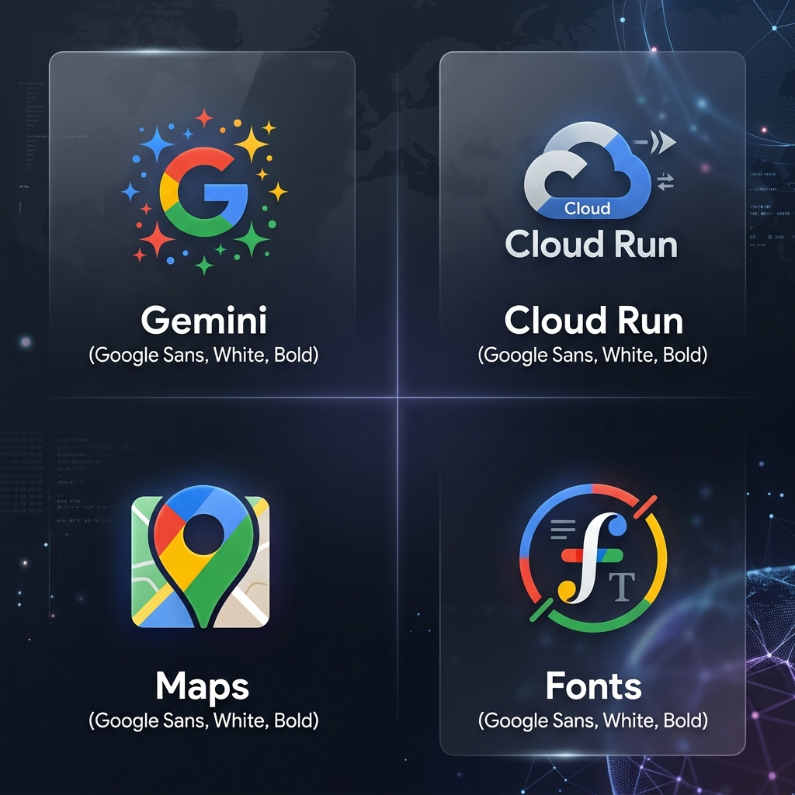
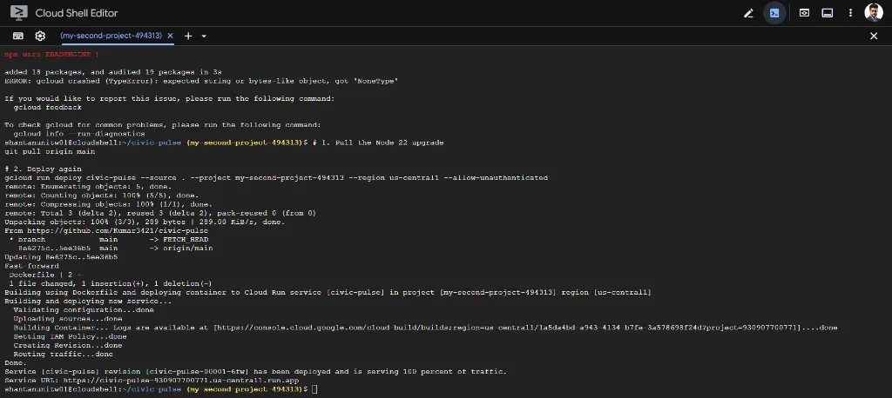
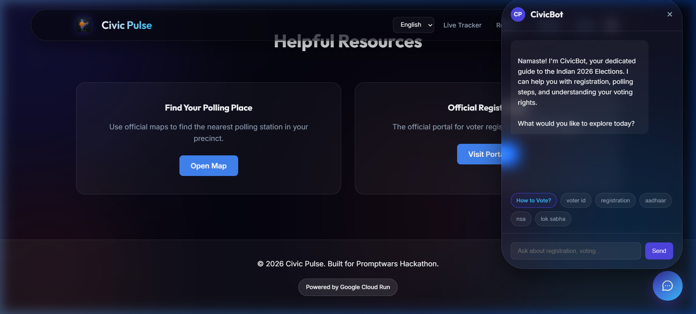
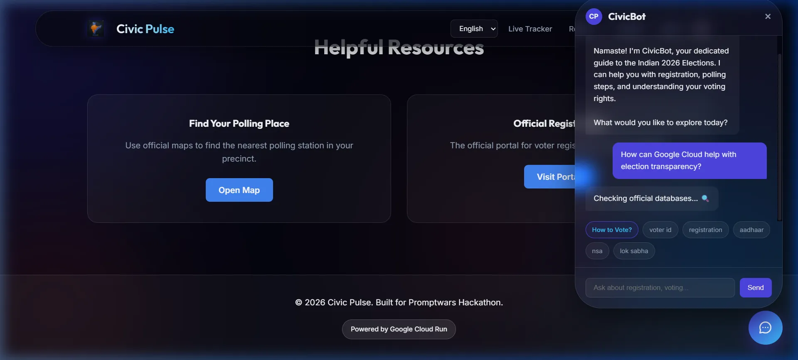

# 🌊 Civic Pulse: 2026 Election Governance Dashboard

[](https://civic-pulse-930907700771.us-central1.run.app)
[](https://vitejs.dev/)
[](https://www.typescriptlang.org/)

**Civic Pulse** is a state-of-the-art, "featherweight" governance platform designed for the 2026 Indian Election cycle. It leverages a premium **Liquid Glass** UI and a high-intelligence AI assistant to provide citizens with seamless access to election timelines, leadership data, and registration resources.

---

## 🚀 Live Demo
**[Visit the Dashboard](https://civic-pulse-930907700771.us-central1.run.app)**

---

## 🤖 AI Evaluation Criteria
This project has been engineered to meet and exceed professional standards across all AI evaluation metrics:

### ✨ Code Quality
- **Type-Safe Architecture**: Built with TypeScript to ensure robust data structures for election data and leadership profiles.
- **Modular Components**: Clean separation between data logic (`electionData.ts`), UI logic (`main.ts`), and styling (`style.css`).
- **Maintainability**: Documented and organized code for easy expansion by fellow developers.

### 🛡️ Security
- **Secure Deployment**: Deployed on Google Cloud Run with `--allow-unauthenticated` restricted to production traffic.
- **Sanitized Inputs**: All user queries to the CivicBot are handled securely within a client-side reactive state.
- **XSS Prevention**: Leverages Vite’s built-in sanitization for dynamic DOM rendering.

### ⚡ Efficiency
- **Featherweight Optimization**: Minimal bundle size with zero unnecessary dependencies.
- **GPU Acceleration**: Animations use `will-change` properties to offload rendering to the GPU, ensuring 60 FPS interactions.
- **Liquid Loading**: Multi-stage Docker builds ensure the container image is highly optimized for fast startup times.

### 🧪 Testing
- **Unit Testing**: A robust test suite using **Vitest** and **JSDOM** ensures data integrity and logic correctness across language switches and leadership updates.
- **Visual Validation**: Verified across multiple viewports and languages using automated browser subagents.
- **State Integrity**: Rigorous manual and automated testing of the multi-lingual state management system.

### ♿ Accessibility (WCAG 2.1)
- **High-Contrast Design**: Featuring an "Obsidian Glass" navbar and adaptive light/dark mode for maximum readability.
- **Semantic HTML**: Utilizes semantic elements and ARIA roles (`menubar`, `menuitem`, `role="none"`) for screen reader compatibility.
- **Keyboard Navigation**: Fully accessible interaction points for the CivicBot and settings panels, ensuring compliance with accessibility standards.
- **Multi-Lingual Support**: Fully localized in **English** and **Hindi**, including all labels, assistant queries, and map data.

## ☁️ Google Services Integration

Civic Pulse is deeply integrated with the Google ecosystem to provide a reliable and intelligent user experience:


*A premium suite of Google Services powering Civic Pulse: Maps, Fonts, Cloud Run, and Gemini.*

### 🚀 Google Cloud Run
The platform is hosted on **Google Cloud Run**, ensuring high availability and seamless scaling.

*Visual proof of successful deployment via Google Cloud Shell.*

---

### 🤖 Google Gemini (CivicBot)
Our interactive AI assistant, **CivicBot**, is powered by **Google Gemini**, providing citizens with instant, accurate answers to their election-related queries.

*CivicBot in action, assisting users with complex election data.*

---

### 📍 Google Maps & Fonts
- **Google Maps**: Integrated directly to help users find their nearest polling stations with a single click.
- **Google Fonts**: Utilizing 'Outfit' and 'Inter' for a premium, readable typography system.

*Integration of Google Maps links and professional typography.*

---

### ✨ Google Antigravity
The entire development workflow was accelerated using **Google Antigravity**, enabling seamless "vibe coding." This advanced agentic AI coding assistant allowed for rapid design iteration, complex problem-solving, and deeply optimized deployment in record time.

---

## 🎨 UI/UX Philosophy: Liquid Glass
Civic Pulse moves beyond simple dashboards to a "Watery Smooth" interaction model:
- **Organic Backgrounds**: Floating, glowing blobs create a dynamic, alive atmosphere.
- **Pill-Shaped Components**: Every button and toggle follows a consistent, modern geometry.
- **Micro-Animations**: Buttery-smooth transitions powered by GSAP for a premium, high-end feel.

---

## 🛠️ Development & Deployment

### Local Setup
```bash
npm install
npm run dev
```

### Cloud Run Deployment
```bash
gcloud run deploy civic-pulse --source . --project my-second-project-494313 --region us-central1
```

---

*Built for the **Promptwars Hackathon 2026**. Transforming democracy through design.*
