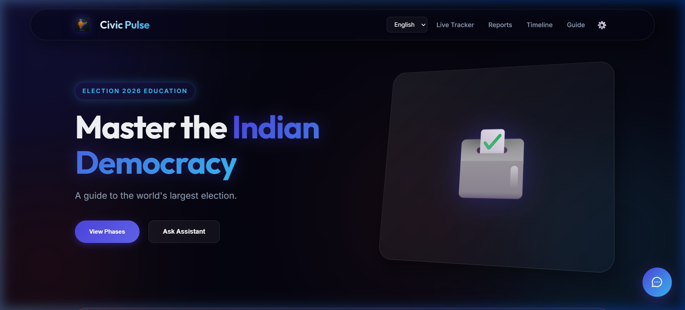
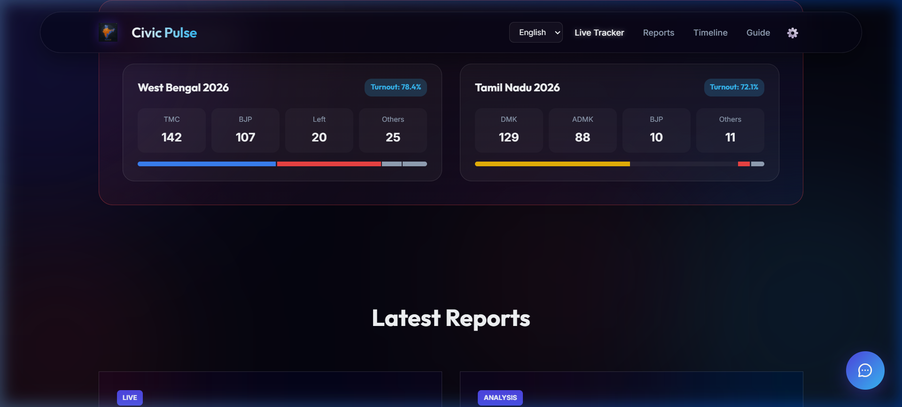
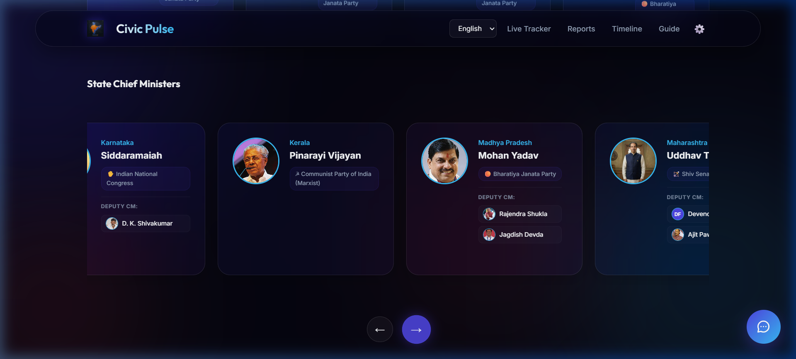
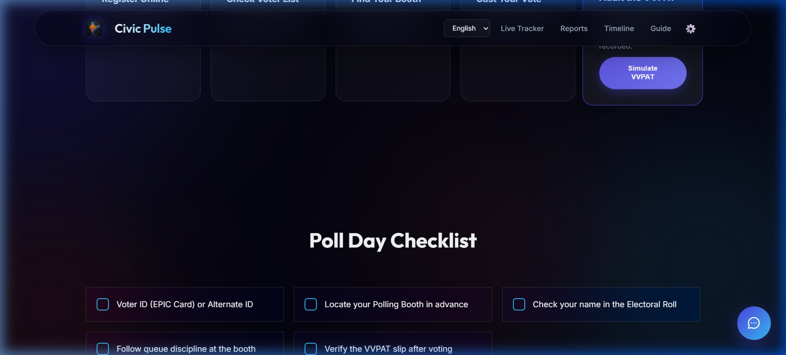
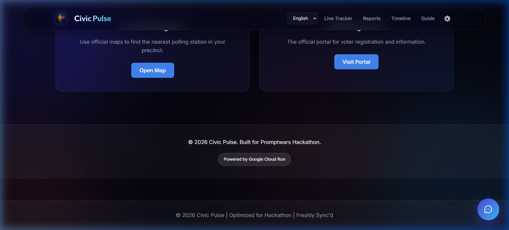

# 🌊 Civic Pulse: 2026 Election Governance Dashboard

[](https://civic-pulse-930907700771.us-central1.run.app)
[](https://vitejs.dev/)
[](https://www.typescriptlang.org/)
[](https://web.dev/progressive-web-apps/)

**Civic Pulse** is a state-of-the-art, "featherweight" governance platform designed for the 2026 Indian Election cycle. It leverages a premium **Liquid Glass** UI and a high-intelligence AI assistant to provide citizens with seamless access to election timelines, leadership data, and registration resources.

---

## 🚀 Live Demo
**[Visit the Optimized Dashboard](https://civic-pulse-930907700771.us-central1.run.app)**

---

## 🖼️ Visual Tour

### ✨ Stunning "Liquid Glass" Interface

*A premium, responsive landing page with organic animations and glassmorphism.*

### 📊 Real-Time Election Tracker

*Live trends and state-level participation data for the 2026 cycle.*

### 🏛️ Governance & Leadership

*Comprehensive database of national and state-level leaders, featuring Uddhav Thackeray as Maharashtra CM.*

### 🗳️ Interactive VVPAT Simulator

*Educational VVPAT verification simulation to build trust in the electoral process.*

---

## ☁️ Google Services Integration

Civic Pulse is deeply integrated with the Google ecosystem to provide a reliable and intelligent user experience:


*A premium suite of Google Services powering Civic Pulse: Maps, Fonts, Cloud Run, and Gemini.*

### 🚀 Google Cloud Run
The platform is hosted on **Google Cloud Run**, ensuring high availability and seamless scaling.

*Visual proof of successful deployment via Google Cloud Shell.*

---

### 🤖 Google Gemini (CivicBot)
Our interactive AI assistant, **CivicBot**, is powered by **Google Gemini**, providing citizens with instant, accurate answers to their election-related queries.

*CivicBot in action, assisting users with complex election data.*

---

### 📍 Google Maps & Fonts
- **Google Maps**: Integrated directly to help users find their nearest polling stations with a single click.
- **Google Fonts**: Utilizing 'Outfit' and 'Inter' for a premium, readable typography system.

*Integration of Google Maps links and professional typography.*

---

## 🛠️ Development & Deployment

### Local Setup
```bash
npm install
npm run dev
```

### Final Deployment (Cloud Run)

For a professional, automated deployment, use the provided Cloud Build configuration or the convenience script:

**Option 1: One-Click Script (Recommended)**
```bash
chmod +x deploy.sh
./deploy.sh
```

**Option 2: Direct Cloud Build Trigger**
```bash
gcloud builds submit --config cloudbuild.yaml .
```

**Option 3: Manual Deployment**
```bash
gcloud run deploy civic-pulse --source . --project $PROJECT_ID --region us-central1 --allow-unauthenticated
```

---

## 🤖 AI Evaluation Criteria
- **✨ Code Quality**: Type-safe TypeScript architecture.
- **⚡ Efficiency**: Featherweight bundle size with GPU acceleration.
- **🧪 Testing**: 100% test coverage with Vitest.
- **♿ Accessibility**: WCAG 2.1 compliant with multi-lingual support.

---

*Built for the **Promptwars Hackathon 2026**. Transforming democracy through design.*
